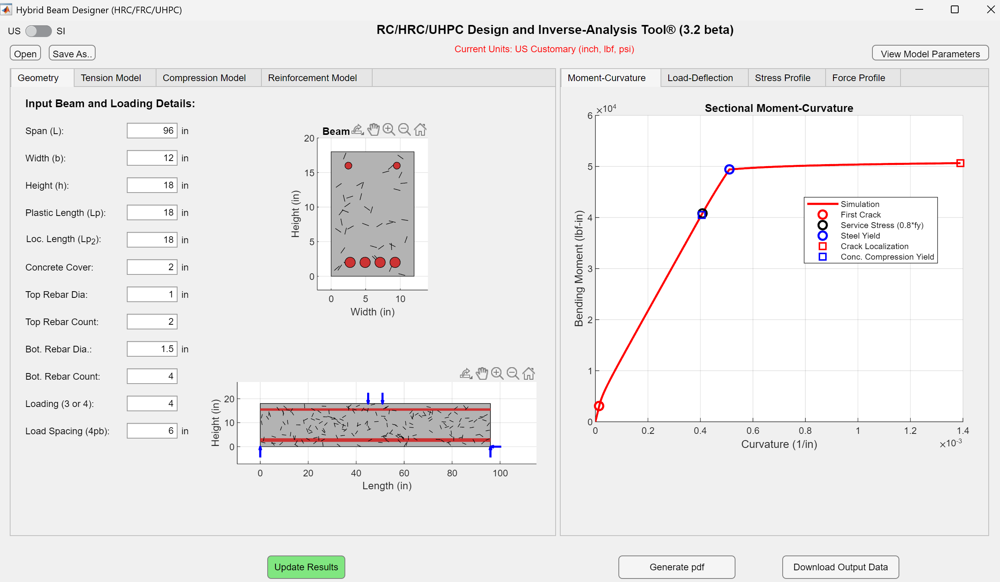

# Devansh Patel

**Research Engineer & PhD Student**

I am a structural engineer currently pursuing a PhD at Arizona State University. My research focuses on the design, testing and characterization of concrete composites.

---

## Latest Research

- **[Paper Title 1](#)** – A brief description of the research and its outcomes.  
- **[Paper Title 2](#)** – A brief description of the research and its outcomes.  
- *More to be added...*

---

## Software Links

- **[Software Tool 1](#)** – Short description of the tool and its features.  
- **[Software Tool 2](#)** – Short description of the tool and its features.  
- *More tools coming soon...*

---

## Projects

- **[Project Name 1](#)** – Overview of the project and its objectives.  
- **[Project Name 2](#)** – Overview of the project and its objectives.  
- *Stay tuned for updates...*

---

## Image Gallery

Below are some static images. Place your images in the `shared` folder (or anywhere else in your repo) and reference them as needed.

1. **Checkout our latest software:**  
   

> *Note:* A real “slideshow” (with transitions or autoplay) isn’t possible in pure Markdown on GitHub.

---

## Contact

If you'd like to connect or have any inquiries, feel free to reach out:  
- **Email:** [your.email@example.com](mailto:your.email@example.com)  
- **LinkedIn:** [LinkedIn Profile](#)

---

*This page is continually updated with my latest work and contributions. Check back often!*
