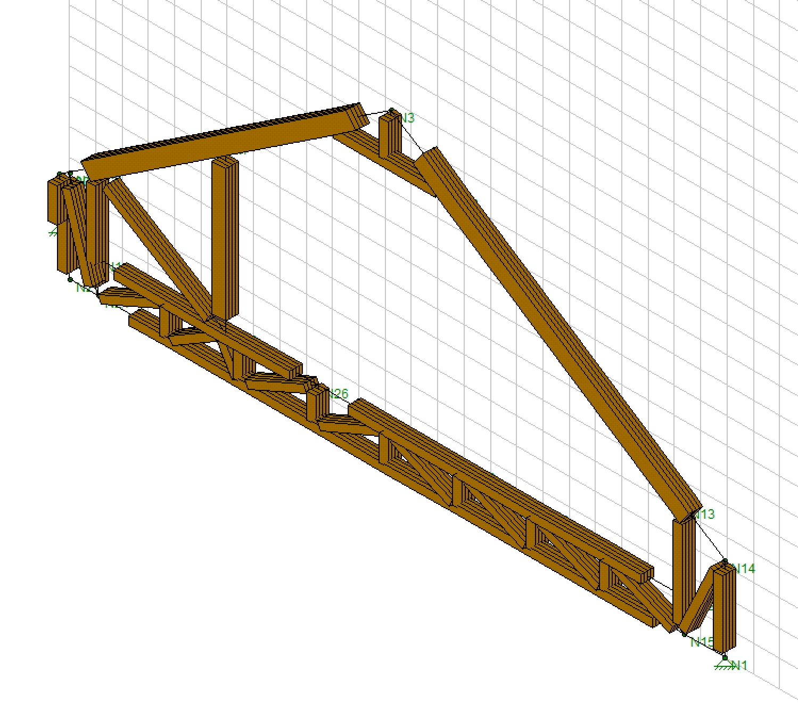

<!--
   ____            _                       _     
  |  _ \ __ _  ___| |__   ___  _   _ _ __ | |__  
  | |_) / _` |/ __| '_ \ / _ \| | | | '_ \| '_ \ 
  |  __/ (_| | (__| | | | (_) | |_| | |_) | | | |
  |_|   \__,_|\___|_| |_|\___/ \__,_| .__/|_| |_|
                                   |_|            
-->

# Devansh Patel  
*Research Engineer & PhD Student*

  <!-- Profile Picture -->
  

    <!-- Update the image path below to match your file name in the 'shared' folder -->
    
  

  <!-- Intro Text -->
  

    
Welcome to my GitHub page—a simple, retro-styled hub where I share my research, projects, and software tools. 
    I'm a research engineer and PhD student specializing in AI research. My work blends timeless aesthetics 
    with cutting-edge innovation.

  

---

## Latest Research

Stay tuned for my latest research papers, articles, and publications.  
- **[Paper Title 1](#)** – A brief description of the research and its outcomes.  
- **[Paper Title 2](#)** – A brief description of the research and its outcomes.  
- *More to be added...*

---

## Software Links

Here you'll find links to the software tools and projects I've developed:  
- **[Software Tool 1](#)** – Short description of the tool and its features.  
- **[Software Tool 2](#)** – Short description of the tool and its features.  
- *More tools coming soon...*

---

## Projects

A collection of my projects and collaborative works:  
- **[Project Name 1](#)** – Overview of the project and its objectives.  
- **[Project Name 2](#)** – Overview of the project and its objectives.  
- *Stay tuned for updates...*

---

## Photo Gallery

Below is a dynamic photo slideshow. Place your images in the `shared` folder, then update the `slides` array with the correct file names (PNG, JPG, etc.) and descriptions.

  <!-- Initial slide image -->
  
  
Description for photo 1

---

## Contact

If you'd like to connect or have any inquiries, feel free to reach out:  
- **Email:** [your.email@example.com](mailto:your.email@example.com)  
- **LinkedIn:** [LinkedIn Profile](#)

---

*This page is continually updated with my latest work and contributions. Check back often for new research and project updates!*
